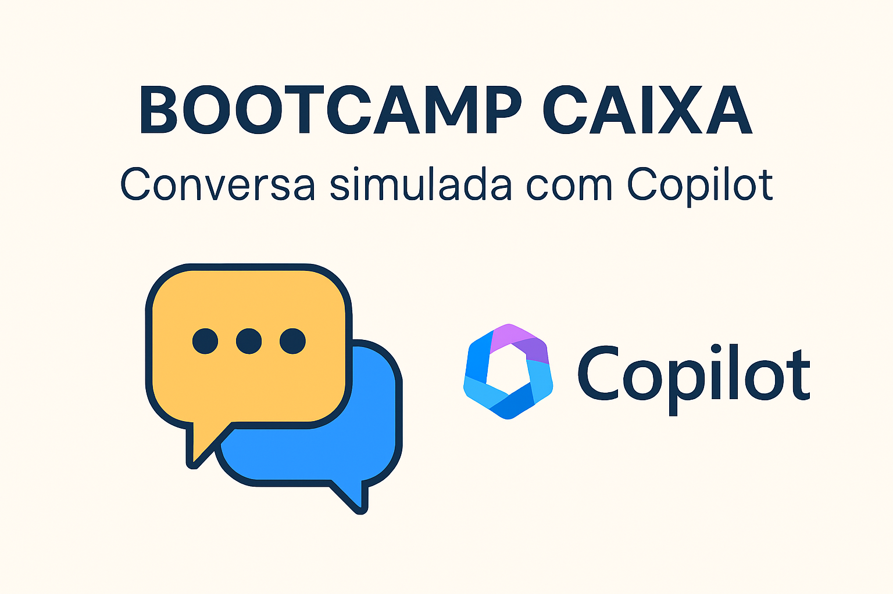

# Bootcamp Caixa - Conversa com Copilot

> ℹ️ **NOTE:** Este repositório documenta a atividade prática proposta no bootcamp da Caixa pela plataforma DIO.  
> O objetivo foi realizar uma conversa com o **Microsoft Copilot**, utilizando um prompt inicial fornecido pelo instrutor, e registrar tanto o prompt quanto toda a entrevista simulada.

---

## 📌 Introdução e Descrição

Durante o bootcamp, foi solicitado que os alunos simulassem uma interação com o Copilot para compreender como estruturar prompts e analisar as respostas da IA.  
A atividade reforça o aprendizado sobre **engenharia de prompt** e o uso de ferramentas de IA aplicadas em cenários profissionais, neste caso para a vaga de **Instrutor de Trânsito**.

---

## 🎯 Prompt Utilizado

---

## 💬 Entrevista Simulada com Copilot

### Pergunta 1
**Copilot:** Poderia me contar sobre sua experiência anterior e como ela se relaciona com o papel de Instrutor de Trânsito?  
**Resposta:** Fui instrutor na MGM Engenharia no modal ferroviário, durante a ministração do treinamento de ROF - Regulamento de Operação Ferroviária, cumpri a meta de reciclar o treinamento do time de 50 pessoas de todos os turnos de trabalho.

---

### Pergunta 2
**Copilot:** Como você adapta sua forma de ensinar quando precisa lidar com diferentes perfis de alunos?  
**Resposta:** Procuro alinhar todos, mesmo que tenha pessoas com mais experiência, começo com a matéria como se ninguém tivesse experiência. Vou buscando entender todos os perfis e vejo se posso acelerar ou diminuir a forma de passar o conteúdo.

---

### Pergunta 3
**Copilot:** Como você lida com situações em que um aluno apresenta resistência ou dificuldade em seguir regras de trânsito?  
**Resposta:** Procuro entender todo o contexto de vida do aluno, para ver quais são suas dificuldades, quais são os desafios no aprendizado e procuro direcionar se o caso for mais sério, por exemplo: o aluno precisa de um acompanhamento psicológico, direciono para o meu superior imediato para auxiliar na tomada de decisão.

---

### Pergunta 4
**Copilot:** Como você organiza seus planos de aula e projetos de conscientização?  
**Resposta:** Uso o auxílio de materiais pré-estabelecidos pela instituição e procuro moldar conforme as necessidades da turma, adicionando conhecimentos que estão fora da apostila com uso de inteligência artificial, livros, sites, blogs e materiais acadêmicos.

---

### Pergunta 5
**Copilot:** Como você mede o sucesso dos seus treinamentos?  
**Resposta:** Procuro trazer temas cotidianos e perguntar como os alunos tomariam decisões a partir do cenário criado em sala. Colocaria algumas dinâmicas em grupo, teste de avaliação de conhecimento dinâmicos usando tecnologias.

---

### Pergunta 6
**Copilot:** Como você se mantém atualizado em relação às normas de trânsito e às melhores práticas de ensino?  
**Resposta:** Estou em grupos específicos de instrutores, tenho contato com pessoas do setor de trânsito em âmbito nacional, procuro na internet as normas, tenho newsletter sobre o assunto, faço cursos de atualização online e faço estudos através da inteligência artificial.

---

### Pergunta 7
**Copilot:** Como você se organiza para cumprir metas e prazos?  
**Resposta:** Gosto muito de usar o Trello e o calendário do Google para me organizar e cumprir tudo em minha vida.

---

### Pergunta 8
**Copilot:** Como você enxerga o papel do Instrutor de Trânsito na sociedade?  
**Resposta:** Um instrutor do Sest é aquele que precisa ser um formador de opinião, passando todas as normas e instruções para que o aluno seja um motorista melhor tanto no trânsito, quanto na sociedade. Quando o aluno sai bem formado de sala de aula, ele vira um disseminador de bons conhecimentos.

---

### Pergunta Final
**Copilot:** Por que você acredita que é o candidato ideal para ser Instrutor de Trânsito no Sest Senat?  
**Resposta:** Devido à minha experiência na área de transportes nos modais ferroviários e rodoviários, o senso de responsabilidade em formar pessoas capacitadas para o trânsito no Brasil. Busco aprimorar minhas habilidades para ser um ótimo profissional, ajudando no crescimento positivo do Sest e o meu próprio.

---

## 🔍 Diagnóstico de Evolução

### ✅ Pontos Fortes
- Experiência prática em treinamentos técnicos.  
- Didática adaptável a diferentes perfis de alunos.  
- Empatia e escuta ativa.  
- Organização com ferramentas digitais.  
- Atualização constante em normas e metodologias.  
- Clareza sobre o papel social do instrutor.  

### 📈 Pontos de Evolução
- Buscar certificações específicas exigidas pelo Sest Senat (MOPP, direção defensiva, primeiros socorros).  
- Ampliar experiência direta com veículos pesados e primeira habilitação.  
- Dominar metodologias pedagógicas formais (andragogia, avaliação formativa).  
- Produzir materiais didáticos próprios.  
- Participar de projetos comunitários de conscientização no trânsito.  

---

## 🧭 Plano de Estudos (1h por dia)

- **Semana 1:** Fortalecimento pedagógico (andragogia, metodologias ativas).  
- **Semana 2:** Atualização em legislação de trânsito (CTB, resoluções CONTRAN).  
- **Semana 3:** Planejamento de aulas e projetos educativos.  
- **Semana 4:** Comunicação e oratória.  
- **Semana 5:** Tecnologia na educação (Trello, Canva, quizzes interativos).  
- **Semana 6:** Simulação e autoavaliação (gravar e revisar aulas).  

---

## 👨‍💻 Autor

    
    
&nbsp&nbsp&nbspYugo Pereira 
    &nbsp&nbsp&nbsp
    <a href="https://github.com/yugopereira">
        GitHub
    </a>
    &nbsp;|&nbsp;
    <a href="www.linkedin.com/in/yugopereira">
        LinkedIn
    </a>
    &nbsp;|&nbsp;
    <a href="https://www.instagram.com/yugopereira/">
        Instagram
    </a>
    &nbsp;|&nbsp;

  

---

⌨️ com 💜 por [Yugo Pereira](https://github.com/YugoPereira)
